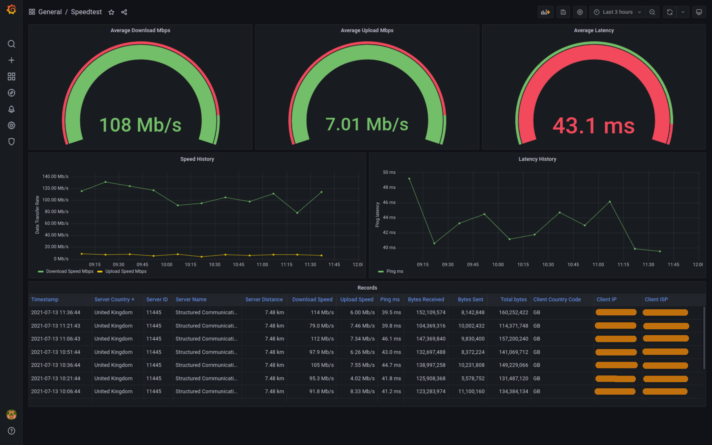

# speedtest-log

## About

> **Warning**: Leaving this tool running in the background will consume a good amount of data. By default, this runs every 15 minutes, and each test can consume anywhere between 80MB and 1GB (downloads / uploads combined).

Performs periodic internet speedtests, logs the results and presents and visualises everything in a dashboard.



The Grafana dashboard is accessible without authentication, and is readonly.

Data is stored in an `InfluxDB 2` time-series database, and presented using a dashboard on `Grafana 8`.

Under the hood, [speedtest-cli](https://github.com/sivel/speedtest-cli) is used to run the actual speedtests against the Ookla Speedtest network.

The following containers are started up:

| Name | Image | Depends on | Custom build | Purpose |
| -----| ----- | ---------- | ------------ | ------- | 
| `influxdb` | `influxdb:2.0-alpine` | - | No | Time-series database to store the actual speed test records. |
| `grafana` | `grafana/grafana:latest` | `influxdb` | No | Graphing and visualisation tool, reading from the InfluxDB. |
| `speedtest-cli` | `alpine:latest` | `influxdb` | Yes, hence why `docker-compose build` is required as part of the setup steps below. | Inclusion of [speedtest-cli](https://github.com/sivel/speedtest-cli), as well as a daemon that periodically runs the test and ships the results to `influxdb`. |

## Setup

### System requirements

Any `AMD64`, `ARM64` `ARM` architecture running Docker, should support this tool.

Tested on the following setups:
* Intel Core i5 running Ubuntu 21.04 + Docker v20.10.7
* Raspberry Pi 4 running Ubuntu 20.04 + Docker v20.10.7

### Environment requirements

* [Docker](https://docs.docker.com/engine/install/)
* [Docker Compose](https://docs.docker.com/compose/install/)

### Steps

1. Clone this project: `git clone <todo_url_here>`
2. Run: `cd speedtest-log`
3. **Optional**: Modify parameters inside [.env](.env).
4. **Optional**: Modify any parameters inside [docker-compose.yml](docker-compose.yml).
5. Run: `docker-compose build`
6. Run: `docker-compose up -d`

Then visit [http://localhost:3000/d/_rotihm7k/speedtest](http://localhost:3000d/_rotihm7k/speedtest) _(takes you straight to the `General / Speedtest` dashboard)_.

**DO NOT** delete the contents inside `influx/` after the first run, or you will lose all the data collected so far!

Standard `docker-compose` management commands are used to manage and monitor the running containers.

### Configuration

The default configuration should suffice. Passwords / tokens are static and probably for the purpose of this tool, do not need to change. However, should you wish to change them, you would need to do so in a number of places. This would be described accordingly below.

All modifiable params are under [.env](.env).

| Key | Description | Avoid changing |
| --- | ----------- | -------------- |
| `DOCKER_INFLUXDB_INIT_USERNAME` | The Influx DB username. This needs to match with the datasource configuration inside Grafana. | Avoid |
| `DOCKER_INFLUXDB_INIT_PASSWORD` | The Influx DB password. | Avoid |
| `DOCKER_INFLUXDB_INIT_ORG` | The Influx DB organisation. This needs to match with the datasource configuration inside Grafana. | Avoid |
| `DOCKER_INFLUXDB_INIT_BUCKET` | The Influx DB bucket. This needs to match with the dashboard queries. | Avoid |
| `DOCKER_INFLUXDB_INIT_RETENTION` | The Influx DB retention period. | Avoid |
| `DOCKER_INFLUXDB_INIT_MODE` | The influx DB initialisation mode. This should not be modified. | Avoid |
| `DOCKER_INFLUXDB_INIT_ADMIN_TOKEN` | The Influx DB token. This needs to match with the datasource configuration inside Grafana. | Avoid |
| `SPEEDTEST_INTERVAL_MINUTES` | The interval, in minutes, between each speedtest run. | Can modify |
| `SPEEDTEST_SERVER` | **Optional**: If set, this would contain the speedtest server ID to test against. If you have `speedtest-cli`, you can use `speedtest-cli --list` to export a list of server IDs available to you. | Can modify |

### Backing up

To back-up, simply take a snapshot of the `influx/` directory. Make sure you don't lose structure or permissions of individual files when doing so.

A recommended way would be:

```bash
tar czvf /path/to/backup/location/speedtest-log_backup-yyyymmdd.tar.gz influx/
```

## Future improvements and development

* The `speedtest-cli` image, is not monitoring for any `SIGINT` during container shutdown, causing `docker-compose` to wait too much and then getting killed forcefully after the timeout.
* All passwords / tokens used in the setup above to be autogenerated during first initialisation, to avoid having shared credentials.

Feel free to share ideas in the issues section, or raise pull requests to this repository.

## Acknowledgements

* [Grafana](https://grafana.com/)
* [InfluxDB](https://www.influxdata.com/)
* [speedtest-cli](https://github.com/sivel/speedtest-cli)
* [Ookla Speedtest](https://www.speedtest.net/)
* [Python](https://www.python.org/)
* [Docker](https://www.docker.com/)
* [ischedule Python library](https://github.com/aleksve/ischedule)

If you feel you should have been included in this list, kindly contact me or raise a PR with the inclusion - I apologise for any omissions, it's not intentional.

***EOF***   
